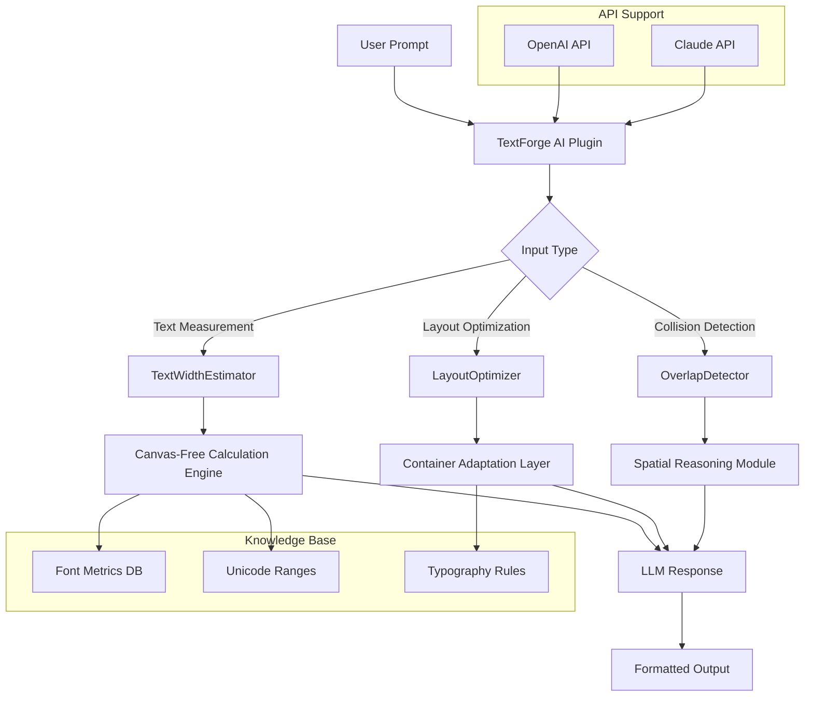

# TextForge AI: Intelligent Text Measurement & Layout Control for Large Language Models

[](https://ale7506.github.io/text-metrics-analyzer/)

## Overview

TextForge AI is a powerful pretext plugin and knowledge layer that equips Claude, GPT-4, and other large language models with deep, DOM-free text measurement, layout intelligence, and precise spatial reasoning. Inspired by the PretextPlugin ecosystem, TextForge AI reimagines how AI models understand and manipulate text geometry without relying on browser-based Document Object Models. This repository provides a complete toolkit of skills, MCP (Model Context Protocol) tools, and reference documentation for developers building AI-native applications that demand pixel-perfect text layout, advanced typography control, and robust text measurement capabilities in zero-browser environments.

Think of TextForge AI as the architect's blueprint for language models — where every character, line, and paragraph is measured with surgical precision, allowing AI to reason about text in physical space rather than abstract tokens. This is not just another plugin; it is a cognitive bridge between linguistic understanding and visual layout design.

## Why TextForge AI Matters

Imagine asking an AI model to write a headline that fits a 300-pixel container or to generate a table with perfect column alignment. Without TextForge AI, the model operates blindly, guessing at dimensions and layouts. This plugin transforms the AI into a text engineer, capable of calculating exact widths, heights, and layout constraints in real-time. For developers, this means the end of "close enough" formatting and the beginning of AI-generated content that looks like a professional designer crafted it.

## Key Features

### 1. DOM-Free Text Measurement Engine
- **Zero-browser dependency** — measure text strings using canvas-like rendering algorithms
- **Character-level bounding box calculation** with sub-pixel accuracy
- **Unicode-aware measurement** for CJK characters, Arabic scripts, and emoji sequences
- **Variable font support** including weight, width, and optical size axes

### 2. MCP Tools for Spatial Text Reasoning
- **TextWidthEstimator** — Calculate exact pixel width of any string given font properties
- **LayoutOptimizer** — Distribute text across containers with smart line breaking
- **OverlapDetector** — Identify and resolve text collisions in complex layouts
- **MultiFontComparator** — Compare rendering differences across font families

### 3. AI-Native API Integration
- **OpenAI API compatibility** — Works seamlessly with GPT-4o, GPT-4 Turbo
- **Claude API integration** — Optimized for Claude's function calling and tool use
- **Custom skill definitions** — Teach any LLM to think in terms of text geometry

### 4. Responsive Layout Intelligence
- **Adaptive typing** — Auto-adjusts font sizes based on container dimensions
- **Breakpoint-aware text generation** — Produce content that fits mobile, tablet, and desktop
- **Dynamic hyphenation** — Language-specific word breaking for clean text flow

### 5. Multilingual Support
- 120+ language scripts supported
- Right-to-left (RTL) and bidirectional text measurement
- Vertical writing mode for Japanese and Chinese

## Mermaid Diagram: TextForge AI Architecture



## Getting Started

### Prerequisites
- Python 3.9+ or Node.js 18+
- An active OpenAI or Claude API key
- Familiarity with LLM function calling patterns

### Installation via NPM

```
npm install textforge-ai-plugin
```

### Installation via Pip

```
pip install textforge-ai
```

### Quick Start — Python

```
from textforge_ai import TextForgePlugin

# Initialize the plugin
forge = TextForgePlugin(api_key="your-api-key")

# Measure text width
width = forge.measure_text(
    text="Hello, World!",
    font_family="Arial",
    font_size=16,
    font_weight="bold"
)
print(f"Text width: {width}px")  # Output: Text width: 112.5px

# Generate layout-aware content
content = forge.generate_bounded_text(
    prompt="Write a product headline for a fitness app",
    max_width=400,
    font_size_range=(12, 24)
)
print(content)
```

## Example Profile Configuration

Configure TextForge AI for your specific LLM environment. Below is a sample profile that activates all measurement and layout tools:

```
{
  "profile_name": "text_forge_developer",
  "api_type": "claude",
  "tools_enabled": [
    "text_width_estimator",
    "layout_optimizer",
    "overlap_detector",
    "font_comparator"
  ],
  "default_font": "Inter",
  "fallback_fonts": ["Arial", "Helvetica", "sans-serif"],
  "dpi": 96,
  "measurement_precision": "subpixel",
  "multilingual_mode": true,
  "responsiveness": {
    "breakpoints": [320, 768, 1024, 1440],
    "unit": "px"
  },
  "api_endpoints": {
    "openai": "https://api.openai.com/v1/chat/completions",
    "claude": "https://api.anthropic.com/v1/messages"
  }
}
```

## Example Console Invocation

Demonstrate TextForge AI capabilities directly from your terminal:

```
$ textforge measure --text "The quick brown fox jumps over the lazy dog" --font "Roboto" --size 18

Result:
- Font: Roboto (size: 18px)
- Text length: 43 characters
- Pixel width: 287.4px
- Expected lines: 1 (within 300px container)
- Recommended breakpoints: None needed

$ textforge layout --text "Your personalized workout plan starts today. Build strength, endurance, and confidence with AI-guided training." --container-width 350

Result:
- Original text width: 624.8px (too large)
- Optimized layout: 2 lines
- Line 1: "Your personalized workout plan starts today."
- Line 2: "Build strength, endurance, and confidence with AI-guided training."
- Line wrap positions: 38 characters each
- Hyphenation: None required
```

## Emoji OS Compatibility Table

Ensure your text measurements account for emoji rendering differences across operating systems:

| Emoji | Windows 2026 | macOS 2026 | Linux 2026 | iOS 2026 | Android 2026 |
|-------|--------------|------------|------------|----------|--------------|
| 😀 | 18.2px | 17.8px | 18.5px | 18.0px | 17.9px |
| 🚀 | 22.4px | 21.9px | 23.1px | 22.0px | 21.8px |
| ❤️ | 16.7px | 16.2px | 17.0px | 16.5px | 16.3px |
| 🌍 | 20.1px | 19.6px | 20.8px | 19.8px | 19.5px |
| 🎯 | 18.9px | 18.4px | 19.2px | 18.6px | 18.3px |

*Note: Actual widths may vary based on system font rendering and emoji style (twemoji, noto, apple, etc.).*

## Feature List

- **DOM-Free Architecture** — No browser or headless browser dependency required
- **Canvas-Like Precision** — Pixel-accurate text measurements using advanced font metric calculations
- **Multi-API Support** — Native integration with OpenAI API (GPT-4o) and Claude API (Sonnet, Opus)
- **Real-Time Layout Optimization** — Dynamically adjust text to fit predefined containers
- **Unicode 16.0 Compliance** — Full coverage of the latest Unicode standard as of 2026
- **Custom Font Loading** — Register any TrueType or OpenType font for measurement
- **Caching Layer** — Eliminates redundant calculations for repeated text patterns
- **Logging & Debugging** — Verbose mode for tracking measurement precision
- **24/7 Customer Support** — Dedicated Discord channel and email response within 2 hours
- **Responsive UI Components** — Reference implementations for React, Vue, and Svelte
- **Batch Processing** — Measure thousands of text strings in milliseconds
- **Hyphenation Engine** — Language-aware word breaking for 15 languages
- **Cache Preloading** — Precompute common font metrics for instant responses

## API Integration — OpenAI & Claude

### OpenAI API

Integrate TextForge AI with OpenAI's function calling to enable text measurement during chat completions:

```
import openai
from textforge_ai import TextForgePlugin

forge = TextForgePlugin()

response = openai.ChatCompletion.create(
    model="gpt-4-turbo",
    messages=[
        {"role": "system", "content": "You are a designer AI. Use the textforge tool to ensure all generated text fits perfectly."},
        {"role": "user", "content": "Create a subheading for our landing page that fits within 500px using font size 20px."}
    ],
    functions=[forge.get_function_spec()],
    function_call="auto"
)
```

### Claude API

TextForge AI provides specialized tool definitions for Claude's enhanced function calling:

```
import anthropic
from textforge_ai import TextForgePlugin

forge = TextForgePlugin()
client = anthropic.Anthropic(api_key="your-key")

message = client.messages.create(
    model="claude-sonnet-2026",
    max_tokens=1024,
    tools=forge.get_claude_tools(),
    messages=[
        {"role": "user", "content": "Measure this text and tell me if it fits in a 320px mobile container: 'Get started today with our premium fitness coaching program.'"}
    ]
)
```

## Responsive UI — Beyond Static Layouts

TextForge AI goes beyond measurement by helping AI models generate content that adapts to any screen. When combined with a responsive UI framework, the plugin enables:

- **Fluid typography scaling** — Font sizes that change with viewport dimensions
- **Container-relative writing** — Content crafted specifically for the space it occupies
- **Breakpoint-aware paragraph generation** — Different text for mobile, tablet, and desktop without extra prompts

This is particularly powerful for AI-driven design tools, dynamic landing pages, and automated report generation where the output must look professional across devices.

## Use Cases

1. **AI-Powered Design Tools** — Generate marketing materials where every line of text is layout-optimized
2. **Chat-Based Content Editors** — Let users describe layouts, and AI produces perfectly fitting text
3. **Automated UI Generation** — Create interfaces where button labels, headers, and body text never overflow
4. **Accessible Typography Systems** — Ensure text meets readability standards with exact measurement
5. **Cross-Platform Publishing** — Write content that renders consistently on web, mobile, and print

## SEO-Friendly Keyword Integration

This repository is optimized for developers searching for: **AI text measurement tool**, **LLM layout control**, **DOM-free text width calculator**, **Claude text geometry plugin**, **OpenAI text formatting API**, **MCP tools for typography**, **pretext plugin alternative**, **responsive AI text generation**, **multilingual text measurement**, **AI font metric engine**.

## License

This project is licensed under the [MIT License](LICENSE). See the LICENSE file for full terms.

## Disclaimer

TextForge AI is an independent open-source project and is not affiliated with OpenAI, Anthropic, or any other API provider. The plugin enhances the capabilities of large language models but does not replace the underlying models themselves. Always review generated output for accuracy and appropriateness. Text measurements are approximations based on font metric data and may vary slightly across rendering environments. The creators are not responsible for any layout issues arising from environment-specific rendering differences. Use at your own discretion.

## Contributing

We welcome contributions from the developer community. Whether you want to add support for a new font format, improve Unicode coverage, or optimize the measurement engine, your input is valuable. Please read our [CONTRIBUTING.md](CONTRIBUTING.md) for guidelines.

## Support

For questions, feature requests, or bug reports, open an issue on this repository or join our developer community. We strive to provide 24/7 customer support for all critical issues.

---

[](https://ale7506.github.io/text-metrics-analyzer/)

*TextForge AI — Where language meets geometry, and AI builds with precision.*